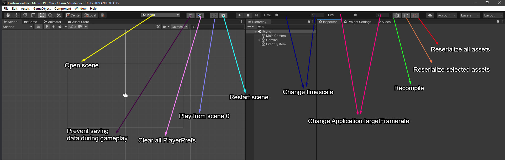
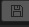

# CustomToolbar
based on this [marijnz unity-toolbar-extender](https://github.com/marijnz/unity-toolbar-extender). 

### Why use CustomToolbar?
This custom tool helps you to test and develop your game easily

_____

when you want to clear all playerprefs you have to follow 3 step:

but you can easily Clear them by clicking on this button:

____________

another button relevant to saving is this button that prevents saving during the gameplay. because sometimes you have to Clear All playerprefs after each test so you can enable this toggle:

Enable Playerprefs:

Disable Playerprefs:

____________

I usually test my games by changing timescale.

____________

you can restart the active scene by this button:

____________

suppose you want to test your game so you should start game from scene 1(Menu):

you have to find scene 1 (Menu):

then you should start the game:

this button is shortcut to start the game from scene 1:

____________

